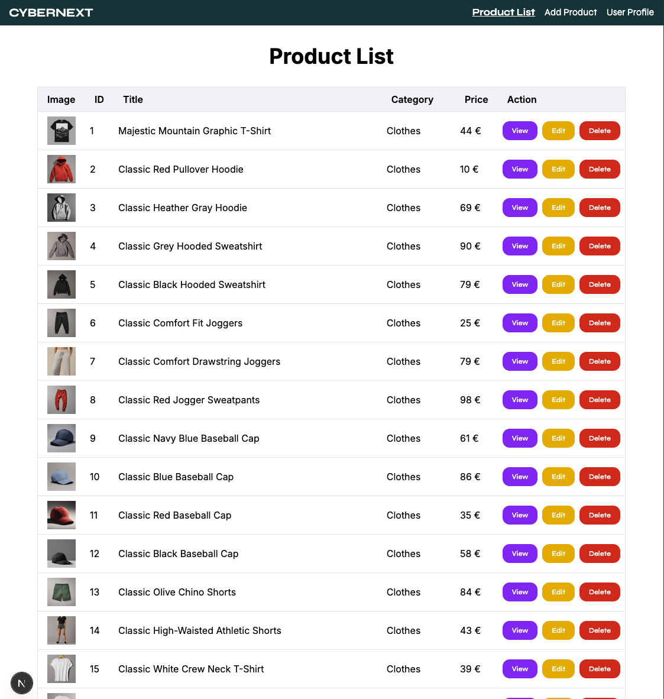
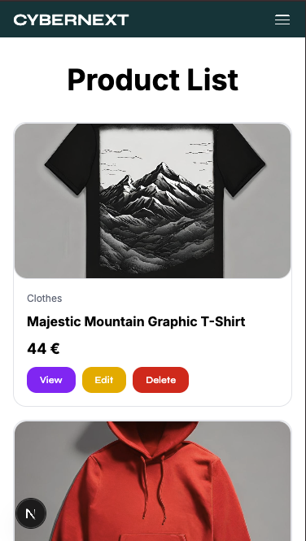

# Cybernext

A responsive product dashboard built with Next.js, React and Tailwind CSS, using the [Platzi Fake Store API](https://fakeapi.platzi.com/).




## Features

- Browse, create, edit and delete products
- Login and user profile
- Responsive layout with mobile menu
- Custom loader and animated 404 page

## Tech stack

Next.js · React · TypeScript · Tailwind CSS

## Getting started

```bash
npm install
npm run dev
```

Open [http://localhost:3000](http://localhost:3000).

## Author

**Giada Antioco**
